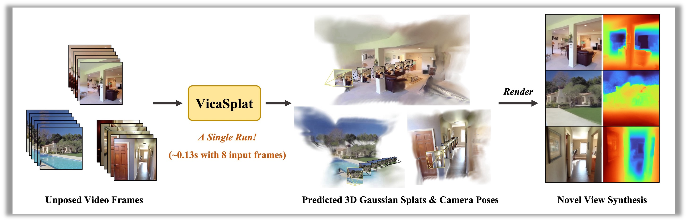

<h2 align=center font-weight:100> <strong><i>VicaSplat</i></strong>: A Single Run is All You Need for 3D Gaussian Splatting and Camera Estimation from Unposed Video Frames</h2>

<h3 align="center">ArXiv 2025</h3>

<h5 align="center">

[](https://arxiv.org/abs/2503.10286)
[](https://lizhiqi49.github.io/VicaSplat/)

</h5>


<p align="center">
  
</p>

Official implementation of **VicaSplat** - feed-forward 3D Gaussians reconstruction and camera pose estimation from unposed video frames in ~0.1s!


## Installation
Our code relies on Python 3.10+, and is developed based on PyTorch 2.4.1 and CUDA 11.8, but it should also work with other Pytorch/CUDA versions as well.

1. Clone VicaSplat.
```bash
git clone https://github.com/WU-CVGL/VicaSplat
cd VicaSplat
```

2. Create the environment, here we show an example using conda.
```bash
conda create -y -n vicasplat python=3.10
conda activate vicasplat
pip install torch==2.4.1 torchvision==0.19.1 torchaudio==2.4.1 --index-url https://download.pytorch.org/whl/cu118
pip install -r requirements.txt
```

3. Optional, compile the cuda kernels for RoPE (as in CroCo v2).
```bash
cd src/model/encoder/backbone/croco/curope/
python setup.py build_ext --inplace
cd ../../../../../..
```

## Pre-trained Checkpoints
Our models are hosted on [Hugging Face](https://huggingface.co/lzq49/VicaSplat) 🤗

|                                                    Model name                                                    | Training resolutions | Training data |
|:----------------------------------------------------------------------------------------------------------------:|:--------------------:|:-------------:|
|         [re10k_8view.ckpt]( https://huggingface.co/lzq49/VicaSplat/resolve/main/re10k_8view.ckpt)                      |        256x256       |     re10k     |
|         [re10k_2view.ckpt]( https://huggingface.co/lzq49/VicaSplat/resolve/main/re10k_2view.ckpt )                     |        256x256       |     re10k     |
|         [acid_2view.ckpt]( https://huggingface.co/lzq49/VicaSplat/resolve/main/acid_2view.ckpt )                       |        256x256       |     acid      |   
<!-- |         [re10k_8view_no_intrin.ckpt]( https://huggingface.co/lzq49/VicaSplat/resolve/main/re10k_8view_no_intrin.ckpt)  |        256x256       |     re10k     |
|         [re10k_2view_no_intrin.ckpt]( https://huggingface.co/lzq49/VicaSplat/resolve/main/re10k_2view_no_intrin.ckpt ) |        256x256       |     re10k     |
|         [acid_2view_no_intrin.ckpt]( https://huggingface.co/lzq49/VicaSplat/resolve/main/acid_2view_no_intrin.ckpt )   |        256x256       |     acid      |    -->

We assume the downloaded weights are located in the `pretrained_weights` directory.

## Camera Conventions
Our camera system is the same as [pixelSplat](https://github.com/dcharatan/pixelsplat). The camera intrinsic matrices are normalized (the first row is divided by image width, and the second row is divided by image height).
The camera extrinsic matrices are OpenCV-style camera-to-world matrices ( +X right, +Y down, +Z camera looks into the screen).

## Datasets
### RealEstate10K & ACID
Our model is mainly trained on [RealEstate10K](https://google.github.io/realestate10k/index.html) and [ACID](https://infinite-nature.github.io/) datasets with resolution 256x256. They are split into ~100 MB chunks for use on server cluster file systems, which is in the same as [pixelSplat](https://github.com/dcharatan/pixelsplat). Please refer to [here](https://github.com/dcharatan/pixelsplat?tab=readme-ov-file#acquiring-datasets) for the preprocessed datasets.
### ScanNet
Our model is also evaluated on [ScanNet](http://www.scan-net.org). Please refer to its official sources, agree to their license, and download it.

## Running the Code
### Training
First download the [MASt3R](https://download.europe.naverlabs.com/ComputerVision/MASt3R/MASt3R_ViTLarge_BaseDecoder_512_catmlpdpt_metric.pth) pretrained model and put it in the `./pretrained_weights` directory.

#### Point Distillation
```bash
# 8 GPUs, with each batch size = 24
python -m src.main +experiment=distill wandb.name=distill
```

#### 2-view Training
```bash
export distilled_model_path=""
# re10k
python -m src.main +experiment=re10k_2view wandb.name=re10k_2view model.encoder.pretrained_weights=$distilled_model_path
# acid
python -m src.main +experiment=acid_2view wandb.name=acid_2view model.encoder.pretrained_weights=$distilled_model_path

## If you do not want the model conditioned on intrinsics, add the option: model.encoder.backbone.use_intrinsic_embedding=false
```

#### 4-view Training
```bash
export pretrained_model_2v_path=""
python -m src.main +experiment=re10k_4view wandb.name=re10k_4view model.encoder.pretrained_weights=$pretrained_model_2v_path
```

#### 8-view Training
```bash
export pretrained_model_4v_path=""
python -m src.main +experiment=re10k_8view wandb.name=re10k_8view model.encoder.pretrained_weights=$pretrained_model_4v_path
```

### Evaluation
#### Novel View Synthesis
```bash
# RealEstate10K-8view
python -m src.main +experiment=re10k_8view mode=test wandb.name=re10k_8view dataset/view_sampler@dataset.re10k.view_sampler=evaluation dataset.re10k.view_sampler.index_path=assets/evaluation_index_re10k_8view_sub.json checkpointing.load=./pretrained_weights/re10k_8view.ckpt test.save_image=true test.align_pose=true test.save_gs=true
```

#### Pose Estimation
To evaluate the pose estimation performance, you can run the following command:
```bash
# RealEstate10K-8view
python -m src.eval_pose +experiment=re10k_8view +evaluation=eval_pose checkpointing.load=./pretrained_weights/re10k_8view.ckpt dataset/view_sampler@dataset.re10k.view_sampler=evaluation dataset.re10k.view_sampler.index_path=assets/evaluation_index_re10k_8view_sub.json
```

### Visulization
The novel view synthesis evaluation procedure defaultly export the 3DGS (.ply file), predicted camera poses (transforms.json) as well as both input and rendered images. 
For visulization of predicted 3D Gaussians and camera poses, you can run the following command:
```bash
python src/visulization/viewer.py --ply path/to/ply --meta_file path/to/transform/json
```
Then just click the printed link in the command line.

## Acknowledgements
This project is developed with several fantastic repos: [pixelSplat](https://github.com/dcharatan/pixelsplat), [NoPoSplat](https://github.com/cvg/NoPoSplat), [DUSt3R](https://github.com/naver/dust3r) and [MASt3R](https://github.com/naver/mast3r). We thank the original authors for their excellent work.

## Citation

```
@article{li2025vicasplat,
      title   = {VicaSplat: A Single Run is All You Need for 3D Gaussian Splatting and Camera Estimation from Unposed Video Frames},
      author  = {Zhiqi Li and Chengrui Dong and Yiming Chen and Zhangchi Huang and Peidong Liu},
      journal = {arXiv preprint arXiv:2503.10286},
      year    = {2025}
    }
```